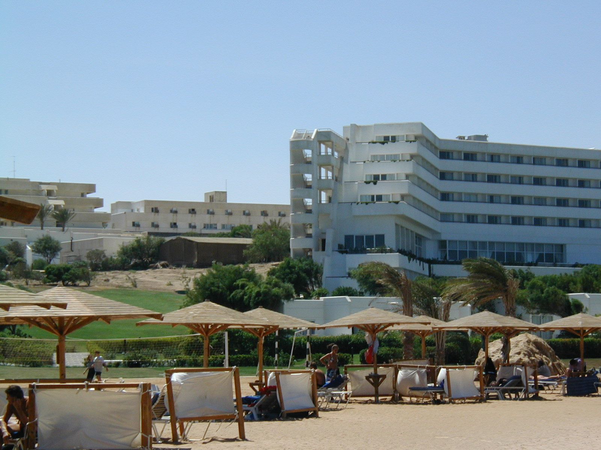

# Panorama-stitching

Run "stitch.py" in terminal and pass the name of the folder containing the images to be stitched. Be sure that the folder does not consist of already stitched image otherwise it may try to stitch that too.

The aim of the project is to understand the underlying concept of finding homogrphy and stitching images rather than using existing APIs to do so.

There should be atleast 15-20% overlap between the images to be stitched. Panorama image stitching is performed from scratch using SIFT match-points to stich multiple images. RANSAC is used to filter out the outliers and homography matrices calculated for the purpose of finding transformations from one image to other. OpenCV or any other image processing libraries have not been used. 

Sample 1

